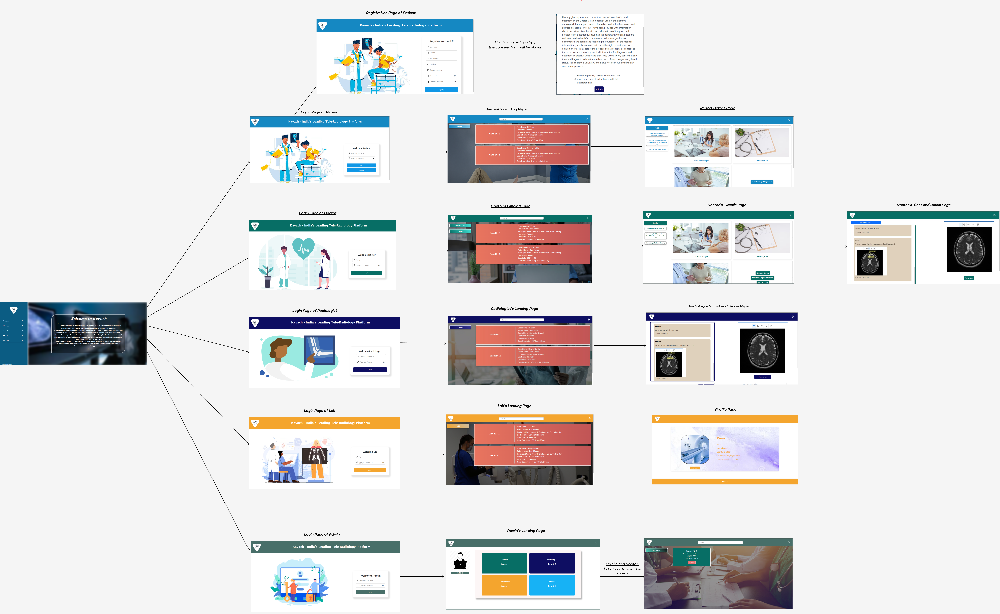

<h4>This is the project we have done as a part of the Course CS837 Healthcare Application Development.</h4> 
<h5> Abstract about our project:</h5>
<h6>
  <ul>
    <li>In the evolving healthcare landscape, effective communication and collaboration are crucial for high-quality patient care. Our tele-radiology app is a cutting-edge platform that revolutionizes interactions among doctors, patients, laboratories, and radiologists. With intuitive interfaces and secure messaging, healthcare providers can share medical images, like X-rays and MRIs, with radiologists for expert analysis, enabling swift diagnoses and treatment plans.</li>
<li>Our app also features an innovative system for assigning lab tests and radiology studies to appropriate professionals based on specialization, availability, and location. Real-time notifications and updates ensure timely assessments of patients' conditions. Data security is paramount, with robust encryption and HIPAA compliance protecting sensitive information. Centralized tracking and auditing enhance accountability and quality assurance.</li>

<li>
  In summary, our tele-radiology app streamlines the diagnostic process, optimizing resource utilization and improving patient outcomes and satisfaction through enhanced communication and collaboration.
</li>

  </ul></h6>

<h5>UI implementation of our project.</h5>
 
</img>
